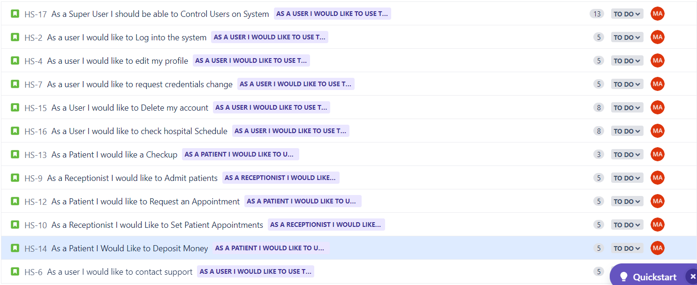
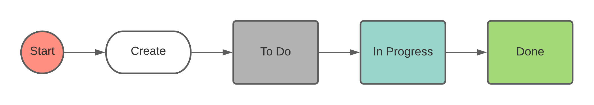
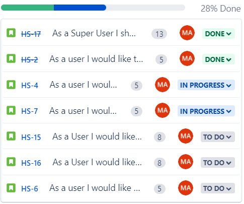
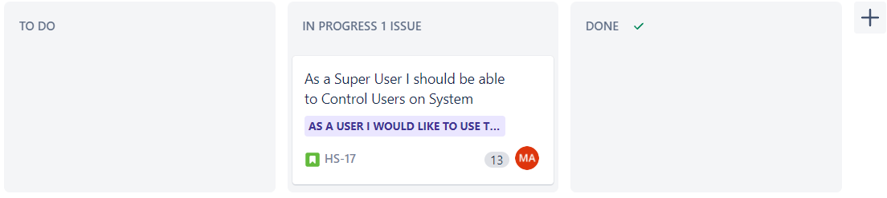
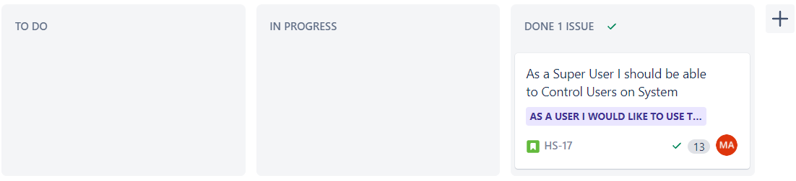
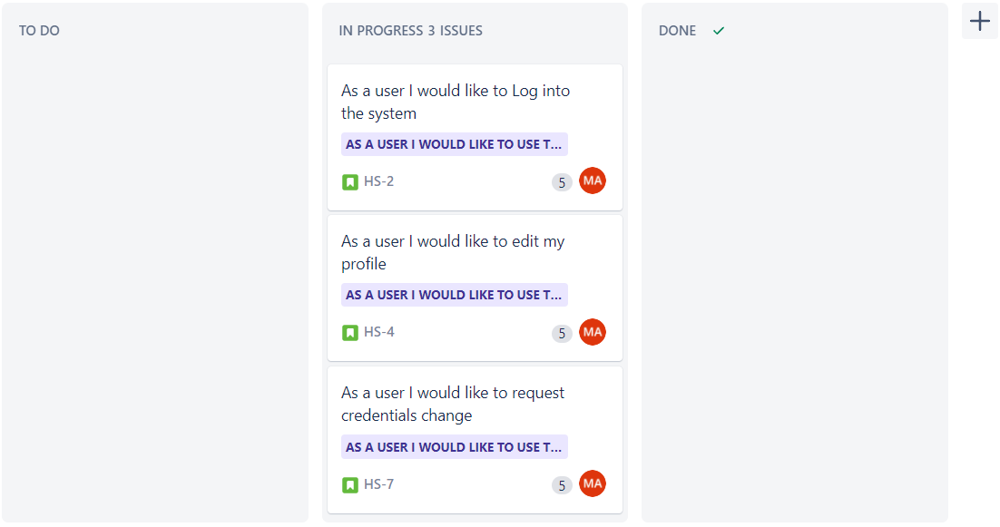
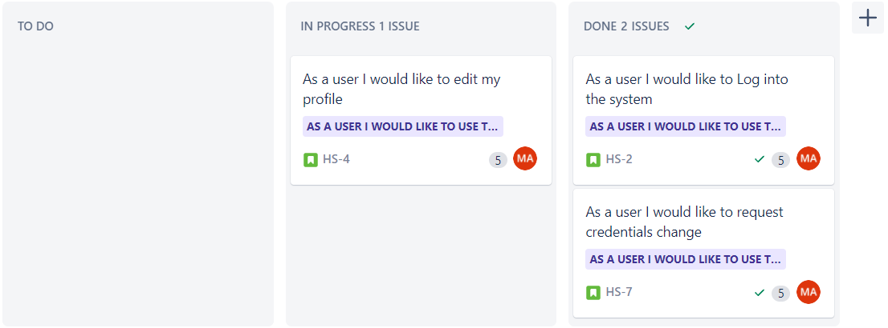

# Hospital System
# Made and Presented BY: 
## Mohamed Yasser Abdel Samad Hassan
## 18P7713
## Group 2 Section 2 UEL
-----------
## Scrum Team
---
### Team 1
Team | Name | Role | Expertise
--- | --- | --- | --- 
Front End | Ahmed | Design | User Interface
Front End | Mohamed | Design | User Experience
Front End | Abdullah | Design | Graphic Designer
Front End | Yasser | Implementation | C# / Visual Basic
Front End | Essam | Implementation | HTML / CSS
---
### Team 2
Team | Name | Role | Expertise
--- | --- | --- | --- 
Back End | Hossam | Design | Database Designer
Back End | Youssef | Design | Backend Designer
Back End | Mazen | Implementation | Database Developer
Back End | Rahmy | Implementation | Javascript Developer
Testing | Ashraf | Front End Testing | Front End Tester
---
### Team 3
Team | Name | Role | Expertise
--- | --- | --- | --- 
Testing | Sayed | Back End Testing | Database and Functionality Test
Testing | Mark | Full Stack Testing | White Box Testing
Testing | Andrew | Stress Testing | Black Box Testing
---
## Stakeholders
| Name | Influence | Availability | Engagement |
| --- | --- | --- | --- |
| Minister Of Health | Very High | Low | Actively Engaged |
| Insurance Company | Very High | High | Keep Satisfied |
| Pharmaceutical Firms | Medium | Low | Keep Informed |
---
## Near Vision
### Sprint 1
1. Create Initial GUI
2. Create basic login model
3. Create basic reception model
### Sprint 2
1. Create Patient Model
2. Create Doctor Model
3. Create Reception Model
4. Create Nurse Model
## Far Vision
The Far vision after finishing most of the sprints is creating a working hospital system that should help patients set appointments with doctors and receptionsts with the abilities to admit new patients and create new accounts for them all that under the super vision of System admins who should initiate the system and its steup at first

---
## Story Points Estimation 
1. Story Point Estimate is set based on how many functional requirments does a story have.
2. As 1 functional requirment = 1 story point, mapped according to fibbonaci numbers.
3. if a story have 5 functional requirments it has 5 story points and if 7 functional requirments it has 8 story points.
---
## Backlog Order

---
## Backlog Order Rationale
Backlog order rationale was based on the functions needed to be to before the others since the system functiona all depend on each other so the programming model or process would be like waterfall finish base functions first then we finish next set of functions that depend on base funcations.

---
## Story Points Per Sprint Estimate
My team should be able to cover 13-20 story points per sprint based on the type of development on it while assuming that each sprint time is 1 week.

---
## Daily Scrum Document
[Click Here To Open Daily Scrum Document](./DailyScrumDocument.pdf)

---

## Workflow

1. At first we start by creating our issue then it is Put into the To Do status as long as we didn't start working on it.
2. The issue is moved from To Do to In Progress status when we start including it into a sprint and start that sprint.
3. Status is changed from In Progress to Done when the issue we were working on is finished and meets the definition of done.

---
## Kanaban
### Sprint 1 Day 3

### Sprint 1 Day 5

---
### Sprint 2 Day 3

### Sprint 2 Day 5

---
# Hospital System
# Made and Presented BY: 
## Mohamed Yasser Abdel Samad Hassan
## 18P7713
## Group 2 Section 2 UEL
-----------
# Github Link
[Click Here To Go To The Github Repo](https://github.com/MoYasser/AgilePracticeExam)
